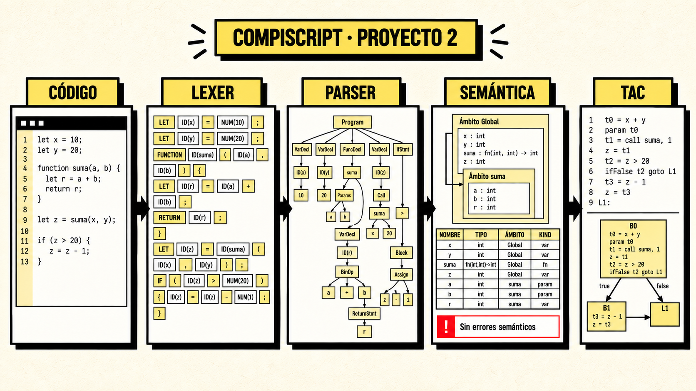
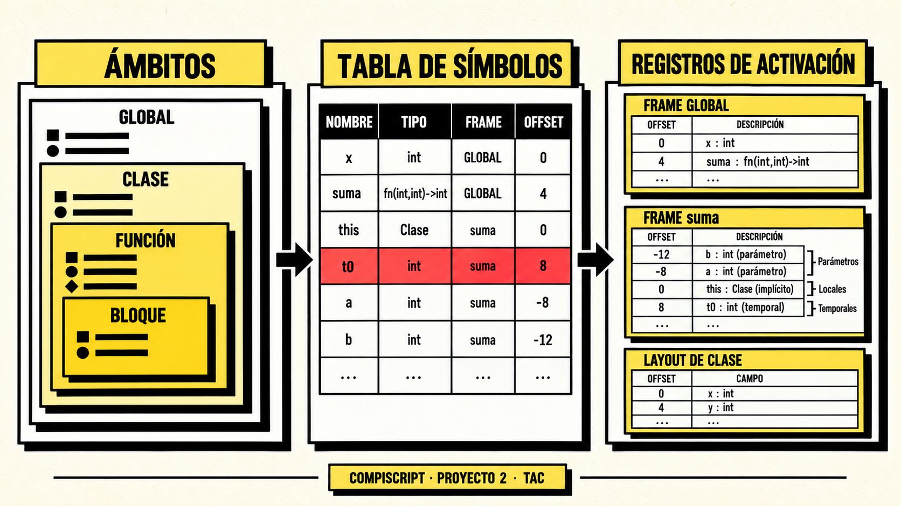

<div align="center">

# Compiscript Semantic & TAC IDE

### Proyecto 2 · Construcción de Compiladores · Sección 10

Un entorno visual para recorrer el frontend de Compiscript y producir código intermedio de tres direcciones verificable.

[](#)
[](https://www.antlr.org/)
[](https://www.typescriptlang.org/)
[](#calidad-y-pruebas)
[](LICENSE)



**[Características](#características)** · **[Inicio rápido](#inicio-rápido)** · **[Ejemplos](#ejemplos-y-cli)** · **[Documentación](#documentación)** · **[Distribución](#distribución)**

</div>

---

## Sobre el proyecto

Este proyecto extiende el frontend de Compiscript construido con ANTLR 4 y añade una cuarta fase observable: la generación de **código intermedio TAC** (*Three-Address Code*). El IDE permite editar o cargar programas `.cps`, ejecutar cada análisis y examinar sus resultados sin depender de la consola.

```text
Código fuente → Lexer → Parser/CST → Semántica → TAC
                                            ├── temporales y etiquetas
                                            ├── bloques básicos
                                            ├── registros de activación
                                            └── layouts de clases
```

> [!IMPORTANT]
> TAC se genera únicamente cuando lexer, parser y análisis semántico terminan sin errores. El alcance finaliza en representación intermedia: el proyecto no interpreta el programa ni produce ensamblador, código máquina o código objeto.

## ¿Qué incorpora el Proyecto 2?

| Área | Implementación actual |
| --- | --- |
| Código intermedio | Instrucciones TAC tipadas, deterministas y vinculadas con línea, columna, ámbito y frame |
| Expresiones | Precedencia, asignaciones, operadores, ternario y cortocircuito lógico |
| Control de flujo | `if`, `while`, `do-while`, `for`, `foreach`, `switch`, `break`, `continue` y `try/catch` |
| Funciones | Parámetros, llamadas, retornos, recursión y closures con variables capturadas |
| Datos compuestos | Arreglos, propiedades, objetos, constructores, métodos y herencia |
| Almacenamiento | Temporales reutilizables, offsets, tamaños, alineación y registros de activación |
| Clases | Layouts deterministas de campos y resolución de métodos heredados |
| Visualización | TAC textual, bloques básicos, tabla de símbolos, ámbitos, árboles y frames |
| Evidencia | Ejemplos positivos y negativos, exportaciones y 132 pruebas automatizadas |

## De la semántica al almacenamiento

La tabla de símbolos no solo conserva nombres y tipos. En modo TAC, cada símbolo utilizable recibe una ubicación abstracta: frame, offset, tamaño y alineación. Los temporales se asignan por frame y se liberan para permitir su reutilización segura.

<div align="center">
  
</div>

## Características

### Frontend del compilador

- Lexer y parser generados con **ANTLR 4 / ANTLR4TS**.
- Recuperación para continuar después de errores léxicos y sintácticos.
- Análisis semántico de nombres, tipos, flujo, arreglos, funciones, clases y closures.
- Tabla de símbolos con inserción, recuperación, actualización, referencias y ámbitos anidados.
- Diagnósticos con fase, severidad, código, línea, columna y explicación.

### Generación TAC

- Recorrido dirigido por los contextos tipados del parser.
- Temporales y etiquetas deterministas por ejecución.
- Operandos asociados con símbolos, ámbitos, frames y offsets.
- Traducción de llamadas, parámetros, retornos, arreglos, campos y objetos.
- Capturas de closures mediante `LOAD_CAPTURE`, `STORE_CAPTURE` y `MAKE_CLOSURE`.
- Bloques básicos y destinos de salto verificables.
- Layouts de clases y registros para global, funciones, métodos y constructores.
- Bloqueo controlado de TAC cuando una fase anterior contiene errores.

### IDE y herramientas

- Editor Monaco con resaltado para Compiscript.
- Explorador de ejemplos y selección de archivos `.cps`.
- Pipeline visual **Lexer → Parser → Semántica → TAC**.
- Paneles para problemas, símbolos, ámbitos, árboles, TAC y flujo visual.
- Exportaciones en texto, CSV y JSON.
- CLI para automatizar las cuatro fases.
- Empaquetado de escritorio mediante Electron Builder.

## Ejemplo TAC

Entrada Compiscript:

```typescript
function suma(a: integer, b: integer): integer {
  return a + b;
}

let resultado: integer = suma(10, 20);
print(resultado);
```

Representación intermedia simplificada:

```text
goto L_after_suma_0
beginfunc fn_scope-0_suma
t0 = a + b
return t0
endfunc fn_scope-0_suma
L_after_suma_0:
param 10
param 20
t0 = call fn_scope-0_suma, 2
resultado = t0
print resultado
```

## Inicio rápido

### Requisitos

- Node.js 20 o superior.
- npm.
- Windows, macOS o Linux para el modo web; Electron para escritorio.

### Windows PowerShell

```powershell
git clone https://github.com/DanielBarillasM/Proyecto-02_CDC_seccion-10_Grupo-DragonsSlayers-2.0_Version-Final.git
Set-Location -LiteralPath ".\Proyecto-02_CDC_seccion-10_Grupo-DragonsSlayers-2.0_Version-Final"

npm.cmd install
npm.cmd run check
npm.cmd test
npm.cmd run dev
```

Abre `http://localhost:3000` en el navegador.

### macOS y Linux

```bash
git clone https://github.com/DanielBarillasM/Proyecto-02_CDC_seccion-10_Grupo-DragonsSlayers-2.0_Version-Final.git
cd Proyecto-02_CDC_seccion-10_Grupo-DragonsSlayers-2.0_Version-Final

npm install
npm run check
npm test
npm run dev
```

## Ejemplos y CLI

Ejecutar el caso integral de TAC:

```powershell
npm.cmd run cli:tac
```

O analizar un archivo específico:

```powershell
npm.cmd run cli -- examples/tac/13_programa_integral.cps --mode tac
```

Comprobar el bloqueo correcto por errores anteriores:

```powershell
npm.cmd run cli -- examples/tac/14_error_lexico.cps --mode tac
npm.cmd run cli -- examples/tac/15_error_sintactico.cps --mode tac
npm.cmd run cli -- examples/tac/16_error_semantico.cps --mode tac
```

| Carpeta | Cobertura |
| --- | --- |
| `examples/compiscript` | Casos base para lexer y parser |
| `examples/semantic` | Tipos, funciones, clases, ámbitos y tabla de símbolos |
| `examples/rubric` | Recuperación léxica y sintáctica con errores alternados |
| `examples/tac` | Expresiones, control, funciones, arreglos, clases, closures y errores |

## Comandos disponibles

| Comando | Propósito |
| --- | --- |
| `npm.cmd run dev` | Inicia el IDE web en modo desarrollo |
| `npm.cmd run check` | Verifica tipos con TypeScript |
| `npm.cmd test` | Ejecuta la batería automatizada completa |
| `npm.cmd run build` | Genera el frontend de producción en `dist/` |
| `npm.cmd run generate` | Regenera lexer, parser y Visitor desde la gramática |
| `npm.cmd run desktop` | Compila y abre la aplicación Electron |
| `npm.cmd run cli -- <archivo> --mode tac` | Ejecuta el pipeline y muestra TAC en consola |

## Calidad y pruebas

Estado verificado de la versión final:

| Verificación | Resultado |
| --- | ---: |
| Archivos de prueba | 8 |
| Pruebas automatizadas | **132 aprobadas** |
| Pruebas TAC directas | 14 |
| TypeScript `--noEmit` | Aprobado |
| Build de producción | Aprobado |
| Revisión del IDE en navegador | 0 errores de consola |

La suite valida determinismo, precedencia, ciclos, llamadas, arreglos, ternarios, `foreach`, almacenamiento, temporales, frames, recuperación y bloqueo entre fases.

## Estructura del repositorio

```text
.
├── src/
│   ├── grammars/          # Gramática activa de Compiscript
│   ├── generated/         # Lexer, parser y Visitor generados por ANTLR
│   ├── semantic/          # Tipos, símbolos, ámbitos y visitors semánticos
│   ├── tac/               # Instrucciones, generador, allocators y frames
│   ├── ui/                # Workbench React y paneles de inspección
│   ├── cli/               # Ejecución desde terminal
│   └── __tests__/         # Pruebas de las cuatro fases
├── examples/
│   ├── compiscript/
│   ├── semantic/
│   ├── rubric/
│   └── tac/
├── docs/                  # Arquitectura, auditoría, matriz e informe heredado
├── electron/              # Proceso principal de escritorio
├── public/                # Recursos estáticos del IDE
└── TAC_DESIGN.md          # Diseño detallado de la representación intermedia
```

## Distribución

| Plataforma | Comando | Resultado |
| --- | --- | --- |
| Windows x64 portable | `npm.cmd run exe:portable` | `.exe` sin instalador |
| Windows x64 instalable | `npm.cmd run exe:installer` | Instalador NSIS |
| macOS Intel/Apple Silicon | `npm run exe:mac` | `.zip` y `.dmg` sin firma |
| Linux x64 | `npm run exe:linux` | `.AppImage` |

> Los paquetes macOS deben generarse en macOS o en un runner compatible. Para Linux se recomienda una instalación nativa, WSL o un contenedor Linux.

## Documentación

- [Diseño de generación TAC](TAC_DESIGN.md)
- [Arquitectura del proyecto](docs/ARQUITECTURA_PROYECTO_1.md)
- [Matriz de requisitos](docs/MATRIZ_REQUISITOS.md)
- [Auditoría técnica](docs/AUDITORIA_PROYECTO_1.md)
- [Decisiones semánticas](docs/DECISIONES_SEMANTICAS.md)
- [Índice documental](docs/README.md)

Los archivos que conservan `PROYECTO_1` en el nombre documentan el frontend heredado. La implementación vigente del Proyecto 2 y sus diferencias están descritas en este README, `TAC_DESIGN.md`, la matriz y la auditoría.

## Tecnologías

`ANTLR 4` · `TypeScript` · `React 19` · `Vite` · `Monaco Editor` · `Vitest` · `Electron`

## Equipo

| DragonsSlayers 2.0 |
| --- |
| Pablo Daniel Barillas Moreno |
| Hugo Daniel Barillas Ajín |
| Ernesto Ascencio |

Construcción de Compiladores — Sección 10.

## Licencia

Distribuido bajo la licencia [MIT](LICENSE).

---

<div align="center">

**Compiscript Semantic & TAC IDE · Proyecto 2**

De caracteres y tokens a símbolos, temporales, bloques y frames.

</div>
